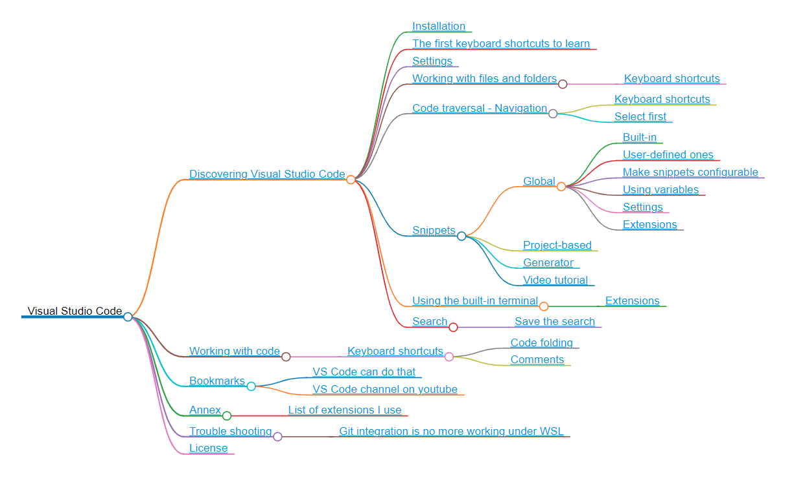

# Convert markdown to a mindmap HTML page

> [https://markmap.js.org/docs/markmap](https://markmap.js.org/docs/markmap)

A small example on how to use markmap as a dockerized application.

Just run `./run.sh` on the command line (if you're under Linux) or run `docker run -it --rm -v %CD%:/project -w /project leopoul/markmap:1.0.0 map.md --output map.html` (if you're under Windows).

The `map.md` file will then be converted as a mindmap. Just start your browser and open the `map.html` file.

Go to [https://markmap.js.org/repl](https://markmap.js.org/repl) for an online editor.

See [https://markmap.js.org/docs/markmap](https://markmap.js.org/docs/markmap) for documentation and options.

## Sample

The generated `map.html` file will use a `<svg>` tag allowing zoom and hyperlinks. Below the same as a png file:

## Structure of the input markdown file

Just take a look on the sample `map.md` file, each branches of your mindmap is an header. So simple.
